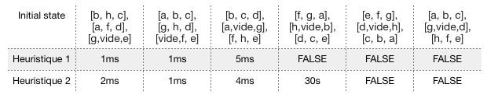

Yanis Imekraz - Jonathan Andrieu

4 IR - IC2

# Rapport TRAVAUX PRATIQUES D'I.A

## ALGORITHME A* - APPLICATION AU TAQUIN

### 1. Familiarisation avec le problème du Taquin 3x3

#### a) Quelle clause Prolog permettrait de représenter la situation finale du Taquin 4x4 ?
```
final_state([[1, 2, 3, 4],
             [5, 6, 7, 8],
             [9, 10, 11, 12],
             [13, 14, 15, vide]).
```

#### b) A quelles questions permettent de répondre les requêtes suivantes :
```
?- initial_state(Ini), nth1(L,Ini,Ligne), nth1(C,Ligne, d).
?- final_state(Fin), nth1(3,Fin,Ligne), nth1(2,Ligne,P)
```
La première question permet de trouver la ligne et la colonne de l'élément "d" dans la matrice "Ini".
La deuxième permet de trouver l'élément présent aux coordonnées Ligne=3 et Colonne=2.

#### c) Quelle requête Prolog permettrait de savoir si une pièce donnée P (ex : a) est bien placée dans U0 (par rapport à F) ?
```
final_state(F),
initial_state(U0),
nth1(L,U0,Ligne),
nth1(C,Ligne,d),
nth1(L1,F,Ligne1),
nth1(C1,Ligne1,d)
```
Réponse de Swi-Prolog:

```
F = [[a, b, c], [h, vide, d], [g, f, e]],
U0 = [[b, h, c], [a, f, d], [g, vide, e]],
L = L1, L1 = 2,
Ligne = [a, f, d],
C = C1, C1 = 3,
Ligne1 = [h, vide, d] 
```
#### On s'intéresse maintenant au prédicat rule/4. Comment l'utiliser pour répondre aux questions suivantes :
#### d) quelle requête permet de trouver une situation suivante de l'état initial du Taquin 3x3 (3 sont possibles) ?

```
initial_state(Ini), rule(R,1,Ini,S2).
```

#### e) quelle requête permet d'avoir ces 3 réponses regroupées dans une liste ? (cf. findall/3 en Annexe).

```
initial_state(Ini), findall(R, rule(R,1,Ini,S2), L).
```

#### f) quelle requête permet d'avoir la liste de tous les couples [A, S] tels que S est la situation qui résulte de l'action A en U0 ?

```
initial_state(U0),findall([A,S],rule(A,1,U0,S),L). 
```

### 2. Développement des 2 heuristiques

Voir le code source disponible dans le dossier TP1.

### 3. Implémentation de A*

#### Noter le temps de calcul de A* et l’influence du choix de l’heuristique : quelle taille de séquences optimales (entre 2 et 30 actions) peut-on générer avec chaque heuristique (H1, H2) ? Présenter les résultats sous forme de tableau.

```
test_time(Runtime) :-
    statistics(runtime,[Start,_]),
    main,
    statistics(runtime,[Stop,_]),
    Runtime is Stop-Start.
```



#### Quelle longueur de séquence peut-on envisager de résoudre pour le Taquin 4x4 ?

#### A* trouve-t-il la solution pour la situation initiale suivante ?

```
initial_state([ [a, b, c], [g,vide,d], [h, f, e]]).
```

Non car cet état est non connexe avec l'etat final donc il n'y a pas de solution.

#### Quelle représentation de l’état du Rubik’s Cube et quel type d’action proposeriez-vous si vous vouliez appliquer A*?

La réprésentation de l'état du Rubik's Cube serait très inspirée de celle du taquin. C'est à dire représenter 

Nous pourrions représenter le Rubik’s Cube comme une liste de matrices décrivant chacune l’état d’un côté du cube. Nous aurions ensuite utilisé sensiblement la même méthode que pour le taquin c’est-à-dire modéliser l’ensemble des rotations possibles du cube et l’état final attendu pour pouvoir ensuite appliquer A*

## ALGO NEGAMAX - APPLICATION AU TICTACTOE

### 1. Familiarisation avec le problème du TicTacToe 3x3

#### 1.2) Quelle interprétation donnez-vous aux requêtes suivantes :
```
?- situation_initiale(S), joueur_initial(J).
?- situation_initiale(S), nth1(3,S,Lig), nth1(2,Lig,o)
```
La première requête permet de définir l'état initial du jeu, ainsi que le joueur qui va commencer.
La deuxième requête permet de placer un o sur la 3ème ligne colonne 2 du jeu.

#### 1.3) Proposer des requêtes de tests unitaires pour les prédicats alignement_gagnat(A,J) et alignement_perdant(A,J).

```
?- A = [x,x,x] alignement_gagnant(A,x).
?- A = [o,o,o] alignement_gagnant(A,x).
?- A = [_,o,_] alignement_gagnant(A,x).
?- A = [o,o,o] alignement_gagnant(A,o).
?- A = [x,x,x] alignement_gagnant(A,o).
?- A = [_,x,o] alignement_gagnant(A,o).
```
Et de même pour alignement_perdant.

### 2. Développemet de l'heuristique h(Joueur,Situation)

#### a) Proposer une requête permettant de tester votre heuristique dans la situation initiale, situation gagnante, situation perdante et situation d'égalité.

```
?- M=[[_,_,_],[_,_,_],[_,_,_]],heuristique(x,M,H).
?- M=[[x,x,x],[o,x,o],[o,o,_]],heuristique(x,M,H).
?- M=[[o,o,o],[x,o,x],[x,x,_]],heuristique(x,M,H).
?- M=[[x,o,x],[x,o,o],[o,x,x]],heuristique(x,M,H).
```

### 3. Développemet de l'algorithme Negamax

#### a) Quel prédicat permet de connaître sous forme de liste l'ensemble des couples  [Coord,Situation_Resultante] tels que chaque élément associe le coup d'un joueur et la situation qui en résulte à partir d'une situation donnée.

Il s'agit du prédicat successeurs(J,Etat,Succ).

### 4. Expérimentation et extensions

#### 4.1) Quel est le meilleur coup à jouer et le gain espéré pour une profondeur d'analyse de 1,2,3,4,5,6,7,8,9. 


#### 4.2) Comment ne pas développer inutilement des situations symétriques de situations déjà développées ? 

Avant de tester une situation, nous effectuons des rotations afin de vérifier que l'état que nous souhaitions tester n'est pas une symétrie d'une situation déjà évaluée.

#### 4.3) Que faut-il reprendre pour passer au jeu du puissance 4 ? 

Il faudrait agir sur les prédicats alignement gagnant ainsi que définir des règles "d'empilage" afin de respecter le puissance 4.

#### 4.4) Comment améliorer l'algorithme en élagant certains coups inutiles (recherche Alpha-Beta) ?

Avant de développer une certaine branche, on compare son meilleur coup avec la valeur du meilleur coup des branches déjà explorées. Celle-ci ne sera explorée que si la valeur potentielle de la branche est plus elevée que celle déjà obtenue dans une autre branche.
